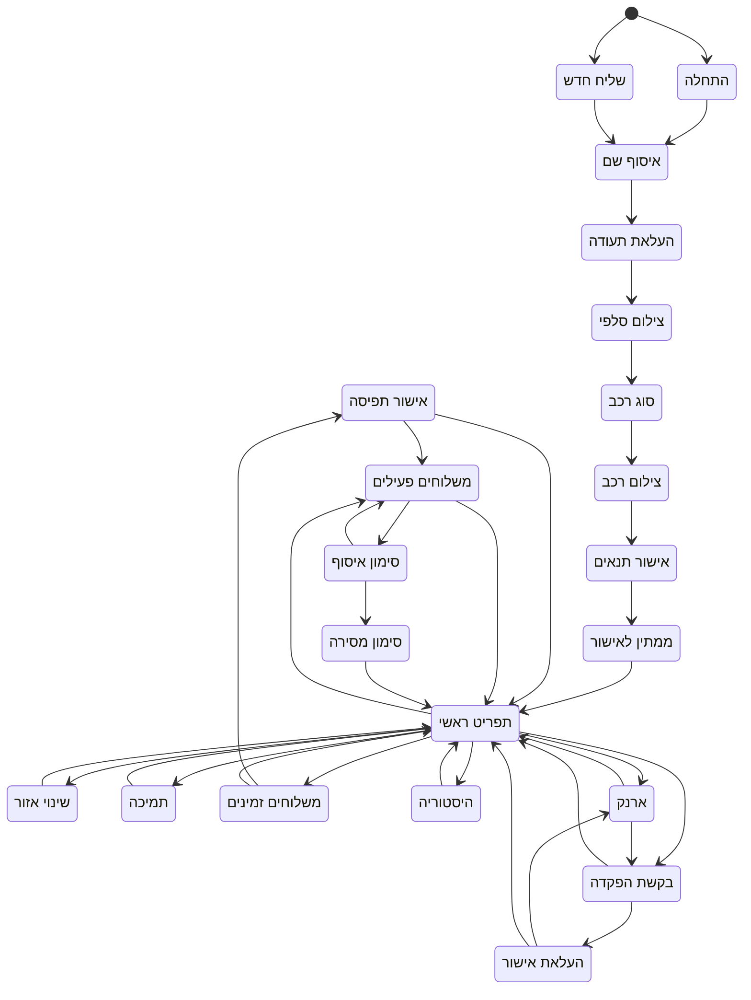
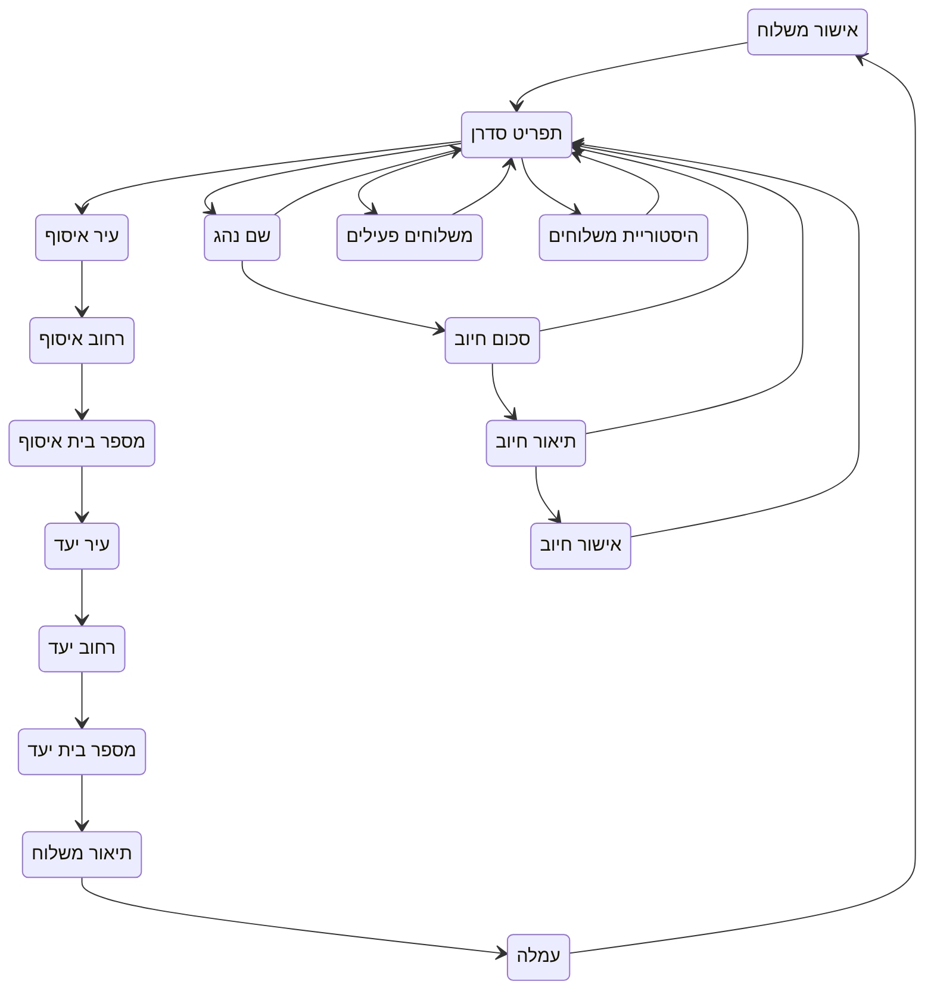
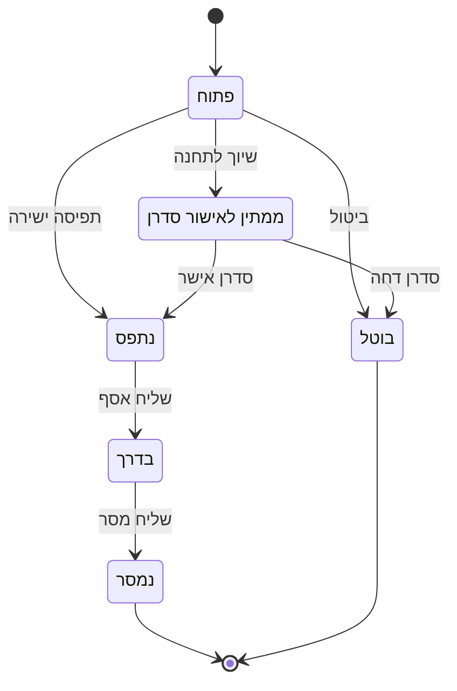
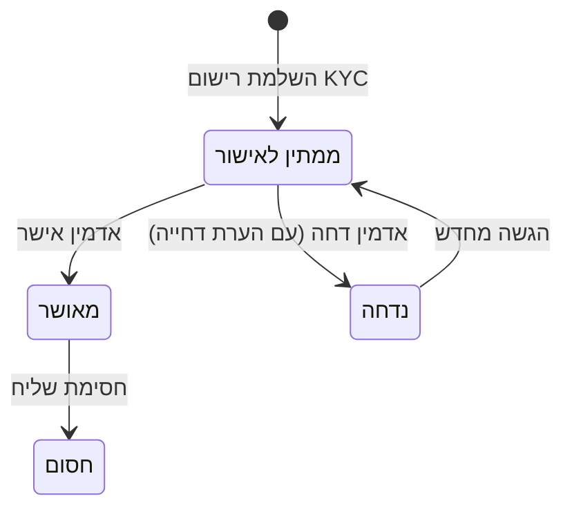

# Shipment Bot - הנחיות לריפו

## סקירת הפרויקט
מערכת בוט לשליחויות לפלטפורמות WhatsApp ו-Telegram, בנויה עם FastAPI, PostgreSQL, Celery ו-Redis.

## ארכיטקטורה
```
Bot Gateway (Webhooks) → Application Layer (State Machine) →
Domain Layer (Services) → Data Layer (PostgreSQL) ↔
Task Queue (Celery + Redis)
```

<!-- STATE_DIAGRAMS_START -->

### דיאגרמות מכונת מצבים

#### שולח (SenderState)

```mermaid
stateDiagram-v2
    INITIAL : התחלה
    SENDER_DELIVERY_CONFIRM : אישור משלוח
    SENDER_DELIVERY_DESCRIPTION : תיאור משלוח
    SENDER_DELIVERY_DROPOFF_APARTMENT : דירה יעד
    SENDER_DELIVERY_DROPOFF_CITY : עיר יעד
    SENDER_DELIVERY_DROPOFF_NUMBER : מספר בית יעד
    SENDER_DELIVERY_DROPOFF_STREET : רחוב יעד
    SENDER_DELIVERY_LOCATION : סוג משלוח
    SENDER_DELIVERY_PICKUP_APARTMENT : דירה איסוף
    SENDER_DELIVERY_PICKUP_CITY : עיר איסוף
    SENDER_DELIVERY_PICKUP_NUMBER : מספר בית איסוף
    SENDER_DELIVERY_PICKUP_STREET : רחוב איסוף
    SENDER_DELIVERY_PRICE : מחיר
    SENDER_DELIVERY_TIME : בחירת שעה
    SENDER_DELIVERY_URGENCY : דחיפות
    SENDER_MENU : תפריט ראשי
    SENDER_NEW : משתמש חדש
    SENDER_REGISTER_COLLECT_NAME : איסוף שם
    SENDER_REGISTER_COLLECT_PHONE : איסוף טלפון
    SENDER_VIEW_DELIVERIES : צפייה במשלוחים

    [*] --> INITIAL
    [*] --> SENDER_NEW

    INITIAL --> SENDER_NEW
    INITIAL --> SENDER_REGISTER_COLLECT_NAME
    SENDER_NEW --> SENDER_REGISTER_COLLECT_NAME
    SENDER_REGISTER_COLLECT_NAME --> SENDER_REGISTER_COLLECT_PHONE
    SENDER_REGISTER_COLLECT_NAME --> SENDER_MENU
    SENDER_REGISTER_COLLECT_PHONE --> SENDER_MENU
    SENDER_MENU --> SENDER_DELIVERY_PICKUP_CITY
    SENDER_MENU --> SENDER_VIEW_DELIVERIES
    SENDER_DELIVERY_PICKUP_CITY --> SENDER_DELIVERY_PICKUP_STREET
    SENDER_DELIVERY_PICKUP_STREET --> SENDER_DELIVERY_PICKUP_NUMBER
    SENDER_DELIVERY_PICKUP_NUMBER --> SENDER_DELIVERY_PICKUP_APARTMENT
    SENDER_DELIVERY_PICKUP_APARTMENT --> SENDER_DELIVERY_LOCATION
    SENDER_DELIVERY_LOCATION --> SENDER_DELIVERY_DROPOFF_CITY
    SENDER_DELIVERY_DROPOFF_CITY --> SENDER_DELIVERY_DROPOFF_STREET
    SENDER_DELIVERY_DROPOFF_STREET --> SENDER_DELIVERY_DROPOFF_NUMBER
    SENDER_DELIVERY_DROPOFF_NUMBER --> SENDER_DELIVERY_DROPOFF_APARTMENT
    SENDER_DELIVERY_DROPOFF_APARTMENT --> SENDER_DELIVERY_URGENCY
    SENDER_DELIVERY_DROPOFF_APARTMENT --> SENDER_MENU
    SENDER_DELIVERY_URGENCY --> SENDER_DELIVERY_TIME
    SENDER_DELIVERY_URGENCY --> SENDER_DELIVERY_DESCRIPTION
    SENDER_DELIVERY_TIME --> SENDER_DELIVERY_PRICE
    SENDER_DELIVERY_PRICE --> SENDER_DELIVERY_DESCRIPTION
    SENDER_DELIVERY_DESCRIPTION --> SENDER_DELIVERY_CONFIRM
    SENDER_DELIVERY_CONFIRM --> SENDER_MENU
    SENDER_VIEW_DELIVERIES --> SENDER_MENU
```



#### שליח (CourierState)



#### סדרן (DispatcherState)



#### בעל תחנה (StationOwnerState)

```mermaid
stateDiagram-v2
    STATION_ADD_BLACKLIST_PHONE : טלפון לחסימה
    STATION_ADD_BLACKLIST_REASON : סיבת חסימה
    STATION_ADD_DISPATCHER_PHONE : טלפון סדרן חדש
    STATION_ADD_OWNER_PHONE : טלפון בעלים חדש
    STATION_COLLECTION_REPORT : דוח גבייה
    STATION_CONFIRM_REMOVE_BLACKLIST : אישור הסרה מרשימה שחורה
    STATION_CONFIRM_REMOVE_DISPATCHER : אישור הסרת סדרן
    STATION_CONFIRM_REMOVE_OWNER : אישור הסרת בעלים
    STATION_EDIT_DESCRIPTION : עריכת תיאור
    STATION_EDIT_NAME : עריכת שם תחנה
    STATION_EDIT_OPERATING_HOURS : שעות פעילות
    STATION_EDIT_SERVICE_AREAS : אזורי שירות
    STATION_GROUP_SETTINGS : הגדרות קבוצות
    STATION_MANAGE_DISPATCHERS : ניהול סדרנים
    STATION_MANAGE_OWNERS : ניהול בעלים
    STATION_MENU : תפריט תחנה
    STATION_REMOVE_BLACKLIST_SELECT : הסרה מרשימה שחורה
    STATION_REMOVE_DISPATCHER_SELECT : בחירת סדרן להסרה
    STATION_REMOVE_OWNER_SELECT : בחירת בעלים להסרה
    STATION_SETTINGS : הגדרות תחנה
    STATION_SET_COMMISSION_RATE : שינוי אחוז עמלה
    STATION_SET_PRIVATE_GROUP : קבוצה פרטית
    STATION_SET_PUBLIC_GROUP : קבוצה ציבורית
    STATION_VIEW_BLACKLIST : רשימה שחורה
    STATION_VIEW_WALLET : ארנק תחנה


    STATION_MENU --> STATION_MANAGE_OWNERS
    STATION_MENU --> STATION_MANAGE_DISPATCHERS
    STATION_MENU --> STATION_VIEW_WALLET
    STATION_MENU --> STATION_COLLECTION_REPORT
    STATION_MENU --> STATION_VIEW_BLACKLIST
    STATION_MENU --> STATION_GROUP_SETTINGS
    STATION_MENU --> STATION_SETTINGS
    STATION_MANAGE_OWNERS --> STATION_ADD_OWNER_PHONE
    STATION_MANAGE_OWNERS --> STATION_REMOVE_OWNER_SELECT
    STATION_MANAGE_OWNERS --> STATION_MENU
    STATION_ADD_OWNER_PHONE --> STATION_MANAGE_OWNERS
    STATION_ADD_OWNER_PHONE --> STATION_MENU
    STATION_REMOVE_OWNER_SELECT --> STATION_CONFIRM_REMOVE_OWNER
    STATION_REMOVE_OWNER_SELECT --> STATION_MANAGE_OWNERS
    STATION_REMOVE_OWNER_SELECT --> STATION_MENU
    STATION_CONFIRM_REMOVE_OWNER --> STATION_MANAGE_OWNERS
    STATION_CONFIRM_REMOVE_OWNER --> STATION_REMOVE_OWNER_SELECT
    STATION_CONFIRM_REMOVE_OWNER --> STATION_MENU
    STATION_MANAGE_DISPATCHERS --> STATION_ADD_DISPATCHER_PHONE
    STATION_MANAGE_DISPATCHERS --> STATION_REMOVE_DISPATCHER_SELECT
    STATION_MANAGE_DISPATCHERS --> STATION_MENU
    STATION_ADD_DISPATCHER_PHONE --> STATION_MANAGE_DISPATCHERS
    STATION_ADD_DISPATCHER_PHONE --> STATION_MENU
    STATION_REMOVE_DISPATCHER_SELECT --> STATION_CONFIRM_REMOVE_DISPATCHER
    STATION_REMOVE_DISPATCHER_SELECT --> STATION_MANAGE_DISPATCHERS
    STATION_REMOVE_DISPATCHER_SELECT --> STATION_MENU
    STATION_CONFIRM_REMOVE_DISPATCHER --> STATION_MANAGE_DISPATCHERS
    STATION_CONFIRM_REMOVE_DISPATCHER --> STATION_REMOVE_DISPATCHER_SELECT
    STATION_CONFIRM_REMOVE_DISPATCHER --> STATION_MENU
    STATION_VIEW_WALLET --> STATION_SET_COMMISSION_RATE
    STATION_VIEW_WALLET --> STATION_MENU
    STATION_SET_COMMISSION_RATE --> STATION_VIEW_WALLET
    STATION_SET_COMMISSION_RATE --> STATION_MENU
    STATION_COLLECTION_REPORT --> STATION_MENU
    STATION_VIEW_BLACKLIST --> STATION_ADD_BLACKLIST_PHONE
    STATION_VIEW_BLACKLIST --> STATION_REMOVE_BLACKLIST_SELECT
    STATION_VIEW_BLACKLIST --> STATION_MENU
    STATION_ADD_BLACKLIST_PHONE --> STATION_ADD_BLACKLIST_REASON
    STATION_ADD_BLACKLIST_PHONE --> STATION_VIEW_BLACKLIST
    STATION_ADD_BLACKLIST_REASON --> STATION_VIEW_BLACKLIST
    STATION_ADD_BLACKLIST_REASON --> STATION_MENU
    STATION_REMOVE_BLACKLIST_SELECT --> STATION_CONFIRM_REMOVE_BLACKLIST
    STATION_REMOVE_BLACKLIST_SELECT --> STATION_VIEW_BLACKLIST
    STATION_REMOVE_BLACKLIST_SELECT --> STATION_MENU
    STATION_CONFIRM_REMOVE_BLACKLIST --> STATION_VIEW_BLACKLIST
    STATION_CONFIRM_REMOVE_BLACKLIST --> STATION_REMOVE_BLACKLIST_SELECT
    STATION_CONFIRM_REMOVE_BLACKLIST --> STATION_MENU
    STATION_GROUP_SETTINGS --> STATION_SET_PUBLIC_GROUP
    STATION_GROUP_SETTINGS --> STATION_SET_PRIVATE_GROUP
    STATION_GROUP_SETTINGS --> STATION_MENU
    STATION_SET_PUBLIC_GROUP --> STATION_GROUP_SETTINGS
    STATION_SET_PUBLIC_GROUP --> STATION_MENU
    STATION_SET_PRIVATE_GROUP --> STATION_GROUP_SETTINGS
    STATION_SET_PRIVATE_GROUP --> STATION_MENU
    STATION_SETTINGS --> STATION_EDIT_NAME
    STATION_SETTINGS --> STATION_EDIT_DESCRIPTION
    STATION_SETTINGS --> STATION_EDIT_OPERATING_HOURS
    STATION_SETTINGS --> STATION_EDIT_SERVICE_AREAS
    STATION_SETTINGS --> STATION_MENU
    STATION_EDIT_NAME --> STATION_SETTINGS
    STATION_EDIT_NAME --> STATION_MENU
    STATION_EDIT_DESCRIPTION --> STATION_SETTINGS
    STATION_EDIT_DESCRIPTION --> STATION_MENU
    STATION_EDIT_OPERATING_HOURS --> STATION_SETTINGS
    STATION_EDIT_OPERATING_HOURS --> STATION_MENU
    STATION_EDIT_SERVICE_AREAS --> STATION_SETTINGS
    STATION_EDIT_SERVICE_AREAS --> STATION_MENU
```



#### סטטוס משלוח (DeliveryStatus)



#### סטטוס אישור שליח (ApprovalStatus)



<!-- STATE_DIAGRAMS_END -->

---

## כללים כלליים

- **שפה: עברית בלבד** — כל הפלט חייב להיות בעברית:
  - כותרת PR ותיאור PR (title + body) — **בעברית**
  - סיכום בצ'אט — **בעברית**
  - הודעות commit — **בעברית**
  - הערות בקוד — **בעברית**
  - כותרות סעיפים ב-PR (כמו "סיכום", "תוכנית בדיקות") — **בעברית**, לא "Summary" / "Test plan"
- **תבנית PR** — בפתיחת PR חובה למלא את התבנית ב-`.github/PULL_REQUEST_TEMPLATE.md`.
  GitHub טוען אותה אוטומטית. יש למלא את כל הסעיפים בעברית ולסמן את הצ'קליסט.

---

## סטנדרטים לקוד

### לוגים
**אסור להשתמש ב-`print()`** - תמיד להשתמש בלוגים מובנים:

```python
from app.core.logging import get_logger

logger = get_logger(__name__)

# נכון
logger.info("Operation completed", extra_data={"user_id": 123, "action": "capture"})
logger.error("Failed to send message", extra_data={"error": str(e)}, exc_info=True)

# לא נכון
print(f"Operation completed for user {user_id}")
```

### פרטיות מספרי טלפון
**חובה למסך מספרי טלפון בלוגים** באמצעות `PhoneNumberValidator.mask()`:

```python
from app.core.validation import PhoneNumberValidator

# נכון - מסתיר את 4 הספרות האחרונות
logger.info("Message sent", extra_data={"phone": PhoneNumberValidator.mask(phone)})
# פלט: +97250123****

# לא נכון - חושף את המספר
logger.info("Message sent", extra_data={"phone": phone})
```

### ולידציית קלט
**כל קלט מהמשתמש חייב עבור ולידציה** באמצעות validators מ-`app/core/validation.py`:

```python
from app.core.validation import (
    PhoneNumberValidator,
    AddressValidator,
    NameValidator,
    TextSanitizer
)

# ולידציית טלפון
if not PhoneNumberValidator.validate(phone):
    raise ValueError("Invalid phone number")
normalized = PhoneNumberValidator.normalize(phone)

# סניטציה של טקסט (מונע XSS/SQL injection)
safe_text = TextSanitizer.sanitize(user_input)
is_safe, pattern = TextSanitizer.check_for_injection(user_input)
```

### הרשאות ומעברי סטטוס
**חובה לבדוק authorization לפני כל פעולה:**

```python
# נכון - בדיקת הרשאה מפורשת
if delivery.sender_id != current_user.id:
    raise ValidationException("אין הרשאה לבצע פעולה זו")

# נכון - ולידציה של מעבר סטטוס לפני עדכון
if delivery.status != DeliveryStatus.PENDING:
    raise ValidationException(
        f"אי אפשר לאשר משלוח בסטטוס {delivery.status}"
    )
```

- **אסור לבצע פעולה בלי לוודא שהמשתמש מורשה** (בעלות על המשאב, תפקיד מתאים)
- **חובה לוולידציה של סטטוס נוכחי** לפני כל מעבר סטטוס - אל תסמוך על הצד הלקוח

### מודלים של Pydantic
**חובה להוסיף field validators לכל מודל Pydantic:**

```python
from pydantic import BaseModel, field_validator

class UserCreate(BaseModel):
    phone_number: str
    name: str | None = None

    @field_validator("phone_number")
    @classmethod
    def validate_phone(cls, v: str) -> str:
        if not PhoneNumberValidator.validate(v):
            raise ValueError("Invalid phone number format")
        return PhoneNumberValidator.normalize(v)
```

### טיפול בשגיאות
**חובה להשתמש ב-exceptions מותאמים מ-`app/core/exceptions.py`:**

```python
from app.core.exceptions import (
    ValidationException,
    NotFoundException,
    DeliveryNotFoundError,
    InsufficientCreditError
)

# נכון - שגיאה מובנית עם קוד
raise DeliveryNotFoundError(delivery_id=123)

# לא נכון - exception גנרי
raise Exception("Delivery not found")
```

**כללים נוספים לטיפול בשגיאות:**
- **אסור `except Exception: pass`** - חובה לעשות log לכל שגיאה, גם אם ממשיכים
- **החזר הודעת שגיאה ברורה למשתמש בעברית** - לא traceback או הודעה באנגלית
- **בכשלון קריטי** (למשל DB + notification) - rollback את כל הטרנזקציה ושלח התראה לאדמין

```python
# לא נכון - בולע שגיאות
try:
    await process_delivery(delivery_id)
except Exception:
    pass

# נכון - לוג + הודעה למשתמש + rollback
try:
    await process_delivery(delivery_id)
except Exception as e:
    logger.error("כשלון בעיבוד משלוח", extra_data={
        "delivery_id": delivery_id, "error": str(e)
    }, exc_info=True)
    await session.rollback()
    return "אירעה שגיאה, נסה שוב מאוחר יותר"
```

### שירותים חיצוניים
**חובה להשתמש ב-Circuit Breaker לכל קריאת API חיצונית:**

```python
from app.core.circuit_breaker import get_telegram_circuit_breaker

circuit_breaker = get_telegram_circuit_breaker()

async def send_message():
    async def _send():
        # קריאת API כאן
        pass

    return await circuit_breaker.execute(_send)
```

### Type Hints
**כל פונקציה חייבת לכלול type hints:**

```python
# נכון
async def create_delivery(
    sender_id: int,
    pickup_address: str,
    fee: float = 10.0
) -> Delivery:
    ...

# לא נכון
async def create_delivery(sender_id, pickup_address, fee=10.0):
    ...
```

### תיעוד API
**כל endpoint חייב לכלול תיעוד OpenAPI:**

```python
@router.post(
    "/",
    response_model=DeliveryResponse,
    summary="Create a new delivery",
    description="Creates a new delivery request with pickup and dropoff addresses.",
    responses={
        200: {"description": "Delivery created successfully"},
        422: {"description": "Validation error"}
    },
    tags=["Deliveries"]
)
async def create_delivery(...) -> DeliveryResponse:
    """
    Create a new delivery request.

    - **sender_id**: ID of the sender user
    - **pickup_address**: Full address for pickup
    """
```

### ביצועים (Performance)
**אסור N+1 queries** - להשתמש ב-eager loading:

```python
# לא נכון - N+1: שליפה נפרדת לכל משלוח
deliveries = await session.execute(select(Delivery))
for d in deliveries:
    print(d.sender.name)  # query נוסף לכל שורה

# נכון - eager loading
from sqlalchemy.orm import joinedload, selectinload

query = select(Delivery).options(
    joinedload(Delivery.sender),       # יחס one-to-one / many-to-one
    selectinload(Delivery.status_logs) # יחס one-to-many
)
```

- **חובה indexes** על שדות בשימוש תכוף ב-WHERE, JOIN, ORDER BY
- **להעדיף batch operations** במקום לולאות עם queries בודדים

### ארגון קוד
- כל endpoint/handler חייב להיות **קצר וקריא**
- הפרד לוגיקה עסקית לפונקציות נפרדות בשכבת ה-services
- אסור "פונקציית ענק" - אם handler ארוך מ-~30 שורות, פצל אותו

---

## דרישות בדיקות

### הרצת בדיקות
```bash
pip install -r requirements-dev.txt
pytest
pytest --cov=app  # עם כיסוי קוד
```

### מבנה בדיקות
- בדיקות יחידה: `tests/test_*.py`
- להשתמש ב-fixtures מ-`tests/conftest.py`
- לעשות mock לשירותים חיצוניים (Telegram, WhatsApp)

### כתיבת בדיקות
```python
import pytest
from app.core.validation import PhoneNumberValidator

class TestPhoneValidation:
    @pytest.mark.unit
    def test_valid_israeli_phone(self):
        assert PhoneNumberValidator.validate("0501234567") is True

    @pytest.mark.unit
    def test_normalize_phone(self):
        assert PhoneNumberValidator.normalize("050-123-4567") == "+972501234567"
```

---

## מבנה קבצים

```
app/
├── api/
│   ├── routes/          # נקודות קצה API
│   └── webhooks/        # Telegram/WhatsApp webhooks
├── core/
│   ├── config.py        # הגדרות
│   ├── logging.py       # לוגים מובנים
│   ├── validation.py    # ולידטורים
│   ├── exceptions.py    # exceptions מותאמים
│   ├── circuit_breaker.py
│   └── middleware.py    # middleware לבקשות
├── db/
│   ├── models/          # מודלים של SQLAlchemy
│   └── database.py      # חיבור לDB
├── domain/
│   └── services/        # לוגיקה עסקית
├── state_machine/       # זרימת שיחה
└── workers/
    └── tasks.py         # משימות Celery
```

---

## דפוסי עיצוב מרכזיים

### Transactional Outbox
הודעות נשמרות בטבלת outbox באותה טרנזקציה עם הפעולה העסקית, ומעובדות באופן אסינכרוני על ידי Celery workers.

### State Machine
זרימות שיחה מנוהלות דרך enums של `SenderState` ו-`CourierState` עם מעברים מוגדרים.

### Correlation IDs
כל בקשה מקבלת correlation ID למעקב:
```python
from app.core.logging import set_correlation_id, get_correlation_id

correlation_id = set_correlation_id()  # מייצר אוטומטית אם לא סופק
```

---

## כללי ניתוב Webhook (telegram.py)

### ניתוב לפי תפקיד
**כל `if role ==` חייב לטפל בכל התפקידים - אסור `else` גנרי:**

```python
# לא נכון - else תופס תפקידים לא צפויים
if user.role == UserRole.COURIER:
    ...
else:
    ...  # STATION_OWNER? ADMIN? מי יודע

# נכון - מפורש לכל תפקיד, עם אזהרה ל-fallback
if user.role == UserRole.COURIER:
    ...
elif user.role == UserRole.STATION_OWNER:
    ...
elif user.role == UserRole.SENDER:
    ...
else:
    logger.warning("Unknown role", extra_data={"role": str(user.role)})
```

להשתמש ב-`_route_to_role_menu()` לכל ניתוב איפוס (שורש, #, /start).
**כשמוסיפים תפקיד חדש - חובה לעדכן את `_route_to_role_menu()`.**

### הגנה על זרימות רב-שלביות
**אסור לבדוק `"keyword" in text` ללא guard על state:**

```python
# לא נכון - תופס כתובות כמו "תחנה מרכזית"
if "תחנה" in text:
    return marketing_response()

# נכון - בודקים קודם אם המשתמש באמצע זרימה
if not _is_in_multi_step_flow:
    if "תחנה" in text:
        return marketing_response()
```

ה-guard `_is_in_multi_step_flow` בודק prefixes: `"DISPATCHER."`, `"STATION."`, ו-states של רישום שליח.
**כשמוסיפים prefix חדש ל-state machine - חובה לעדכן את ה-guard.**

### אטומיות בפעולות DB
- כל **read-modify-write על ארנק** חייב `with_for_update()` (נעילת שורה)
- כל שדה שנכתב **חייב להיות באותה טרנזקציה** - לא לעשות commit ואז לעדכן שדה נוסף

---

## צ'קליסט לפיצ'רים דו-פלטפורמיים (Telegram + WhatsApp)

1. **עקביות בין פלטפורמות** - כל לוגיקה חדשה חייבת לעבוד
   זהה בשתי הפלטפורמות. לא לשכפל קוד - להוציא לשירות משותף.
2. **fallback לקבוצה** - כפתורים לא עובדים בקבוצות.
   בכל fallback לקבוצה: keyboard=None + הנחיות טקסטואליות.
3. **auth בטלגרם** - תמיד לזהות לפי from_user.id (מי לחץ),
   לעולם לא לפי chat.id (איפה ההודעה).
4. **background tasks** - להשתמש ב-background_tasks.add_task()
   לשליחת הודעות. לעולם לא asyncio.create_task (בולע exceptions).
5. **סינון מספרי טלפון** - לסנן גם tg: (placeholder) וגם
   @g.us (מזהה קבוצה) לפני שליחת הודעה אישית.
6. **fallback שמות** - תמיד user.full_name or user.name or 'לא צוין'

---

## צ'קליסט לפני PR

> **חובה למלא את תבנית ה-PR** (`.github/PULL_REQUEST_TEMPLATE.md`) — GitHub טוען אותה אוטומטית בפתיחת PR.

1. **Self-review** - האם כל הסטנדרטים בקובץ הזה מולאו?
2. **Concurrency** - מה קורה אם שני משתמשים עושים את אותה פעולה במקביל?
3. **לוגים** - האם יש מספיק מידע בלוגים כדי לדבג בעיות בפרודקשן?
4. **הודעות שגיאה** - האם המשתמש מקבל הודעה ברורה בעברית בכל מקרה כשלון?
5. **בדיקות** - האם יש בדיקות ל-edge cases ול-happy path?

---

## אסור!

1. **אסור להשתמש ב-`print()`** - להשתמש ב-`logger`
2. **אסור לחשוף מספרי טלפון בלוגים** - להשתמש ב-`PhoneNumberValidator.mask()`
3. **אסור לקבל קלט ללא ולידציה** - להשתמש ב-validators
4. **אסור לקרוא ל-API חיצוני בלי Circuit Breaker**
5. **אסור לכתוב פונקציות בלי type hints**
6. **אסור ליצור endpoints בלי תיעוד OpenAPI**
7. **אסור לעשות commit בלי בדיקות לפיצ'רים חדשים**
8. **אסור `else` גנרי בניתוב לפי תפקיד** - לטפל בכל `UserRole` במפורש
9. **אסור `"keyword" in text` ללא guard** - לבדוק `_is_in_multi_step_flow` קודם
10. **אסור read-modify-write על ארנק בלי `with_for_update()`**
11. **אסור `except Exception: pass`** - חובה לעשות log לכל שגיאה
12. **אסור לבצע פעולה בלי בדיקת authorization** - לוודא שהמשתמש מורשה
13. **אסור מעבר סטטוס בלי ולידציה** - לבדוק סטטוס נוכחי לפני עדכון
14. **אסור N+1 queries** - להשתמש ב-`joinedload`/`selectinload`
