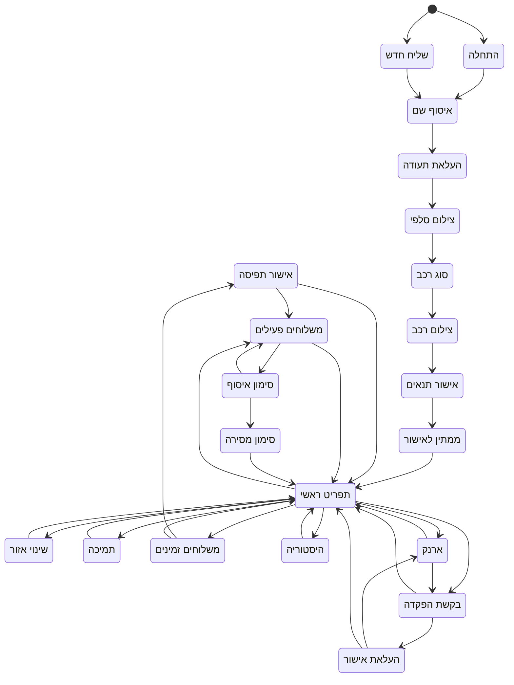
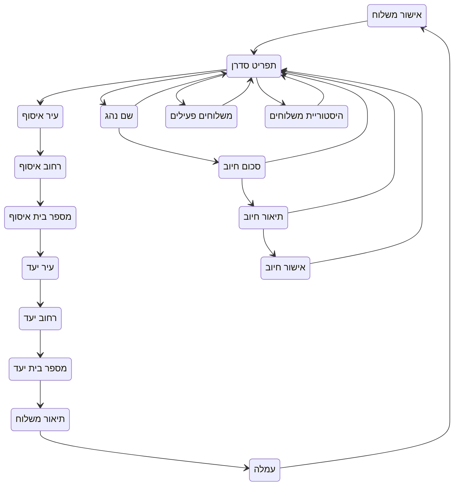
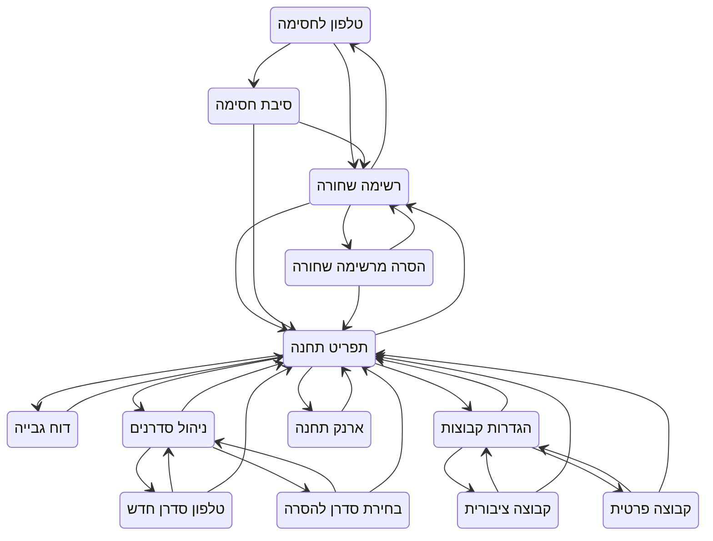
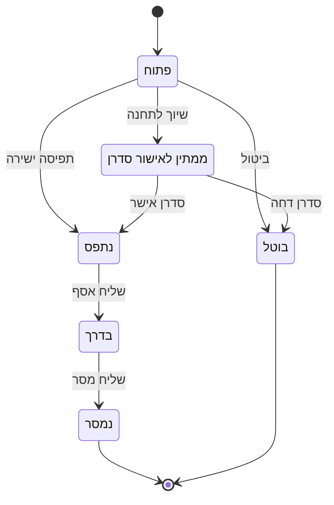
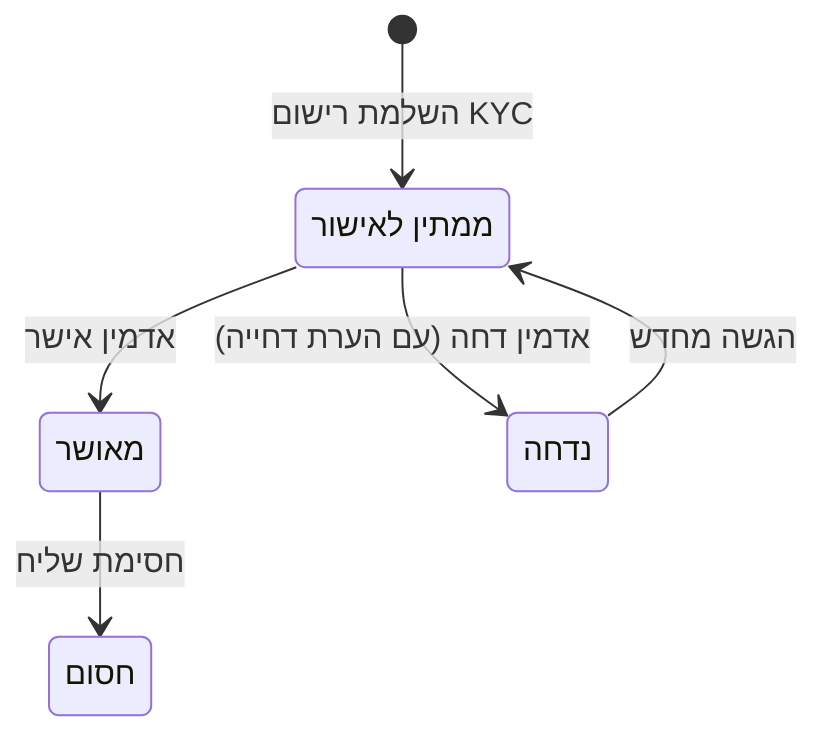

# State Machine - מכונת מצבים

## סקירה כללית

המערכת משתמשת במכונת מצבים (State Machine) לניהול זרימת השיחה עם משתמשים.
כל משתמש נמצא במצב מסוים, וכל הודעה נכנסת גורמת למעבר למצב חדש.

**מקור האמת:** `app/state_machine/states.py` — כל ה-enums וה-transition dictionaries מוגדרים שם.

**ייצור אוטומטי:** ניתן לייצר מחדש את הדיאגרמות באמצעות:
```bash
python scripts/generate_state_diagrams.py
```

---

## מצבי שולח (SenderState)

```mermaid
stateDiagram-v2
    INITIAL : התחלה
    SENDER_DELIVERY_CONFIRM : אישור משלוח
    SENDER_DELIVERY_DESCRIPTION : תיאור משלוח
    SENDER_DELIVERY_DROPOFF_APARTMENT : דירה יעד
    SENDER_DELIVERY_DROPOFF_CITY : עיר יעד
    SENDER_DELIVERY_DROPOFF_NUMBER : מספר בית יעד
    SENDER_DELIVERY_DROPOFF_STREET : רחוב יעד
    SENDER_DELIVERY_LOCATION : סוג משלוח
    SENDER_DELIVERY_PICKUP_APARTMENT : דירה איסוף
    SENDER_DELIVERY_PICKUP_CITY : עיר איסוף
    SENDER_DELIVERY_PICKUP_NUMBER : מספר בית איסוף
    SENDER_DELIVERY_PICKUP_STREET : רחוב איסוף
    SENDER_DELIVERY_PRICE : מחיר
    SENDER_DELIVERY_TIME : בחירת שעה
    SENDER_DELIVERY_URGENCY : דחיפות
    SENDER_MENU : תפריט ראשי
    SENDER_NEW : משתמש חדש
    SENDER_REGISTER_COLLECT_NAME : איסוף שם
    SENDER_REGISTER_COLLECT_PHONE : איסוף טלפון
    SENDER_VIEW_DELIVERIES : צפייה במשלוחים

    [*] --> INITIAL
    [*] --> SENDER_NEW

    INITIAL --> SENDER_NEW
    INITIAL --> SENDER_REGISTER_COLLECT_NAME
    SENDER_NEW --> SENDER_REGISTER_COLLECT_NAME
    SENDER_REGISTER_COLLECT_NAME --> SENDER_REGISTER_COLLECT_PHONE
    SENDER_REGISTER_COLLECT_NAME --> SENDER_MENU
    SENDER_REGISTER_COLLECT_PHONE --> SENDER_MENU
    SENDER_MENU --> SENDER_DELIVERY_PICKUP_CITY
    SENDER_MENU --> SENDER_VIEW_DELIVERIES
    SENDER_DELIVERY_PICKUP_CITY --> SENDER_DELIVERY_PICKUP_STREET
    SENDER_DELIVERY_PICKUP_STREET --> SENDER_DELIVERY_PICKUP_NUMBER
    SENDER_DELIVERY_PICKUP_NUMBER --> SENDER_DELIVERY_PICKUP_APARTMENT
    SENDER_DELIVERY_PICKUP_APARTMENT --> SENDER_DELIVERY_LOCATION
    SENDER_DELIVERY_LOCATION --> SENDER_DELIVERY_DROPOFF_CITY
    SENDER_DELIVERY_DROPOFF_CITY --> SENDER_DELIVERY_DROPOFF_STREET
    SENDER_DELIVERY_DROPOFF_STREET --> SENDER_DELIVERY_DROPOFF_NUMBER
    SENDER_DELIVERY_DROPOFF_NUMBER --> SENDER_DELIVERY_DROPOFF_APARTMENT
    SENDER_DELIVERY_DROPOFF_APARTMENT --> SENDER_DELIVERY_URGENCY
    SENDER_DELIVERY_DROPOFF_APARTMENT --> SENDER_MENU
    SENDER_DELIVERY_URGENCY --> SENDER_DELIVERY_TIME
    SENDER_DELIVERY_URGENCY --> SENDER_DELIVERY_DESCRIPTION
    SENDER_DELIVERY_TIME --> SENDER_DELIVERY_PRICE
    SENDER_DELIVERY_PRICE --> SENDER_DELIVERY_DESCRIPTION
    SENDER_DELIVERY_DESCRIPTION --> SENDER_DELIVERY_CONFIRM
    SENDER_DELIVERY_CONFIRM --> SENDER_MENU
    SENDER_VIEW_DELIVERIES --> SENDER_MENU
```



### תיאור מצבי שולח

| מצב | תיאור | פעולה הבאה |
|-----|-------|-----------|
| `INITIAL` | מצב התחלתי — הודעה ראשונה | מעבר ל-NEW או רישום |
| `SENDER.NEW` | משתמש חדש שזוהה | איסוף שם |
| `SENDER.REGISTER.COLLECT_NAME` | איסוף שם משתמש | איסוף טלפון או תפריט |
| `SENDER.REGISTER.COLLECT_PHONE` | איסוף מספר טלפון | מעבר לתפריט |
| `SENDER.MENU` | תפריט ראשי | משלוח חדש / צפייה במשלוחים |
| `SENDER.DELIVERY.PICKUP_CITY` | עיר איסוף | רחוב איסוף |
| `SENDER.DELIVERY.PICKUP_STREET` | רחוב איסוף | מספר בית |
| `SENDER.DELIVERY.PICKUP_NUMBER` | מספר בית איסוף | דירה |
| `SENDER.DELIVERY.PICKUP_APARTMENT` | דירה (אופציונלי) | סוג משלוח |
| `SENDER.DELIVERY.LOCATION` | בתוך/מחוץ לעיר | עיר יעד |
| `SENDER.DELIVERY.DROPOFF_CITY` | עיר יעד | רחוב יעד |
| `SENDER.DELIVERY.DROPOFF_STREET` | רחוב יעד | מספר בית |
| `SENDER.DELIVERY.DROPOFF_NUMBER` | מספר בית יעד | דירה |
| `SENDER.DELIVERY.DROPOFF_APARTMENT` | דירה יעד | דחיפות / חזרה לתפריט |
| `SENDER.DELIVERY.URGENCY` | מיידי / מאוחר יותר | שעה או תיאור |
| `SENDER.DELIVERY.TIME` | בחירת שעה (רק עבור "מאוחר") | מחיר |
| `SENDER.DELIVERY.PRICE` | מחיר ללקוח (רק עבור "מאוחר") | תיאור |
| `SENDER.DELIVERY.DESCRIPTION` | תיאור המשלוח | אישור |
| `SENDER.DELIVERY.CONFIRM` | אישור ושליחה | חזרה לתפריט |
| `SENDER.VIEW_DELIVERIES` | צפייה בהיסטוריית משלוחים | חזרה לתפריט |

---

## מצבי שליח (CourierState)



### תיאור מצבי שליח

| מצב | תיאור | פעולה הבאה |
|-----|-------|-----------|
| `COURIER.INITIAL` | מצב התחלתי | רישום |
| `COURIER.NEW` | שליח חדש | איסוף שם |
| `COURIER.REGISTER.COLLECT_NAME` | איסוף שם מלא | העלאת תעודה |
| `COURIER.REGISTER.COLLECT_DOCUMENT` | העלאת צילום תעודת זהות | סלפי |
| `COURIER.REGISTER.COLLECT_SELFIE` | צילום סלפי לאימות | סוג רכב |
| `COURIER.REGISTER.COLLECT_VEHICLE_CATEGORY` | בחירת סוג רכב | צילום רכב |
| `COURIER.REGISTER.COLLECT_VEHICLE_PHOTO` | צילום רכב | תנאים |
| `COURIER.REGISTER.TERMS` | אישור תנאי שימוש | ממתין לאישור |
| `COURIER.PENDING_APPROVAL` | ממתין לאישור אדמין | תפריט (לאחר אישור) |
| `COURIER.MENU` | תפריט ראשי | בחירת פעולה |
| `COURIER.VIEW_AVAILABLE` | צפייה במשלוחים זמינים | תפיסה / חזרה |
| `COURIER.CAPTURE_CONFIRM` | אישור תפיסת משלוח | משלוחים פעילים / חזרה |
| `COURIER.VIEW_ACTIVE` | צפייה במשלוחים פעילים | סימון איסוף / חזרה |
| `COURIER.MARK_PICKED_UP` | סימון שנאסף | סימון מסירה / חזרה |
| `COURIER.MARK_DELIVERED` | סימון שנמסר | חזרה לתפריט |
| `COURIER.VIEW_WALLET` | צפייה בארנק | הפקדה / חזרה |
| `COURIER.DEPOSIT_REQUEST` | בקשת הפקדה | העלאת אישור / חזרה |
| `COURIER.DEPOSIT_UPLOAD` | העלאת אישור הפקדה | ארנק / חזרה |
| `COURIER.CHANGE_AREA` | שינוי אזור פעילות | חזרה לתפריט |
| `COURIER.VIEW_HISTORY` | צפייה בהיסטוריה | חזרה לתפריט |
| `COURIER.SUPPORT` | פנייה לתמיכה | חזרה לתפריט |

---

## מצבי סדרן (DispatcherState)



### תיאור מצבי סדרן

> סדרן הוא שליח מאושר עם הרשאות ניהול ברמת תחנה. הוא רואה את תפריט השליח + תפריט סדרן ייעודי.

| מצב | תיאור | פעולה הבאה |
|-----|-------|-----------|
| `DISPATCHER.MENU` | תפריט סדרן ראשי | הוספת משלוח / צפייה / חיוב ידני |
| `DISPATCHER.ADD_SHIPMENT.PICKUP_CITY` | עיר איסוף | רחוב איסוף |
| `DISPATCHER.ADD_SHIPMENT.PICKUP_STREET` | רחוב איסוף | מספר בית |
| `DISPATCHER.ADD_SHIPMENT.PICKUP_NUMBER` | מספר בית | עיר יעד |
| `DISPATCHER.ADD_SHIPMENT.DROPOFF_CITY` | עיר יעד | רחוב יעד |
| `DISPATCHER.ADD_SHIPMENT.DROPOFF_STREET` | רחוב יעד | מספר בית יעד |
| `DISPATCHER.ADD_SHIPMENT.DROPOFF_NUMBER` | מספר בית יעד | תיאור |
| `DISPATCHER.ADD_SHIPMENT.DESCRIPTION` | תיאור המשלוח | עמלה |
| `DISPATCHER.ADD_SHIPMENT.FEE` | עמלת שליח | אישור |
| `DISPATCHER.ADD_SHIPMENT.CONFIRM` | אישור ושליחה | חזרה לתפריט |
| `DISPATCHER.VIEW_ACTIVE_SHIPMENTS` | משלוחים פעילים | חזרה לתפריט |
| `DISPATCHER.VIEW_SHIPMENT_HISTORY` | היסטוריית משלוחים | חזרה לתפריט |
| `DISPATCHER.MANUAL_CHARGE.DRIVER_NAME` | שם נהג לחיוב | סכום / חזרה |
| `DISPATCHER.MANUAL_CHARGE.AMOUNT` | סכום חיוב | תיאור / חזרה |
| `DISPATCHER.MANUAL_CHARGE.DESCRIPTION` | תיאור החיוב | אישור / חזרה |
| `DISPATCHER.MANUAL_CHARGE.CONFIRM` | אישור חיוב | חזרה לתפריט |

---

## מצבי בעל תחנה (StationOwnerState)



### תיאור מצבי בעל תחנה

| מצב | תיאור | פעולה הבאה |
|-----|-------|-----------|
| `STATION.MENU` | תפריט תחנה ראשי | ניהול סדרנים / ארנק / דוח / רשימה שחורה / הגדרות |
| `STATION.MANAGE_DISPATCHERS` | ניהול סדרנים | הוספה / הסרה / חזרה |
| `STATION.ADD_DISPATCHER.PHONE` | הזנת טלפון סדרן חדש | ניהול סדרנים / חזרה |
| `STATION.REMOVE_DISPATCHER.SELECT` | בחירת סדרן להסרה | ניהול סדרנים / חזרה |
| `STATION.VIEW_WALLET` | ארנק תחנה | חזרה לתפריט |
| `STATION.COLLECTION_REPORT` | דוח גבייה | חזרה לתפריט |
| `STATION.VIEW_BLACKLIST` | רשימה שחורה | הוספה / הסרה / חזרה |
| `STATION.ADD_BLACKLIST.PHONE` | טלפון לחסימה | סיבה / חזרה |
| `STATION.ADD_BLACKLIST.REASON` | סיבת חסימה | רשימה שחורה / חזרה |
| `STATION.REMOVE_BLACKLIST.SELECT` | הסרה מרשימה שחורה | רשימה שחורה / חזרה |
| `STATION.GROUP_SETTINGS` | הגדרות קבוצות | ציבורית / פרטית / חזרה |
| `STATION.SET_PUBLIC_GROUP` | הגדרת קבוצה ציבורית | הגדרות / חזרה |
| `STATION.SET_PRIVATE_GROUP` | הגדרת קבוצה פרטית | הגדרות / חזרה |

---

## סטטוס משלוח (DeliveryStatus)



---

## סטטוס אישור שליח (ApprovalStatus)



---

## מעברי מצב (Transitions)

### מעבר תקין
```python
current_state = "SENDER.DELIVERY.PICKUP_CITY"
message = "תל אביב"

# שמירה ב-context
context["pickup_city"] = message

# מעבר למצב הבא
new_state = "SENDER.DELIVERY.PICKUP_STREET"
```

### Context (הקשר)
כל session שומר context עם נתונים זמניים:

```json
{
  "name": "ישראל ישראלי",
  "pickup_city": "תל אביב",
  "pickup_street": "דיזנגוף",
  "pickup_number": "50",
  "pickup_apartment": null,
  "dropoff_city": null,
  "current_delivery_id": null
}
```

## טיפול בשגיאות

### הודעה לא צפויה
```
מצב נוכחי: MENU
הודעה: "בננה"
תגובה: "לא הבנתי. אנא בחרו אפשרות מהתפריט"
מצב חדש: MENU (ללא שינוי)
```

### Timeout
אם משתמש לא מגיב זמן רב, ה-session נשמר ב-DB וממשיך מאותו מצב בהודעה הבאה.

## קוד לדוגמה

```python
class StateHandler:
    async def handle_message(self, user_id, platform, message):
        # קבלת מצב נוכחי
        current_state = await self.get_state(user_id, platform)
        context = await self.get_context(user_id, platform)

        # קבלת handler מתאים
        handler = self.get_handler(current_state)

        # עיבוד ההודעה
        response, new_state, context_update = await handler(message, context)

        # שמירת מצב חדש
        if new_state != current_state:
            await self.transition_to(user_id, platform, new_state, context_update)

        return response
```

## הרחבת מצבים

להוספת מצב חדש:

1. הגדרת המצב ב-`states.py`:
```python
class SenderState(str, Enum):
    NEW_STATE = "SENDER.NEW_STATE"
```

2. הוספה למילון מעברים:
```python
SENDER_TRANSITIONS = {
    ...
    SenderState.PREVIOUS_STATE: [SenderState.NEW_STATE],
    SenderState.NEW_STATE: [SenderState.MENU],
}
```

3. הוספת handler ב-`handlers.py`:
```python
async def _handle_new_state(self, message, context):
    # לוגיקה
    return response, next_state, context_update
```

4. רישום ב-mapping:
```python
handlers = {
    SenderState.NEW_STATE.value: self._handle_new_state,
}
```

5. עדכון הדיאגרמות:
```bash
python scripts/generate_state_diagrams.py --update-claude-md
```
